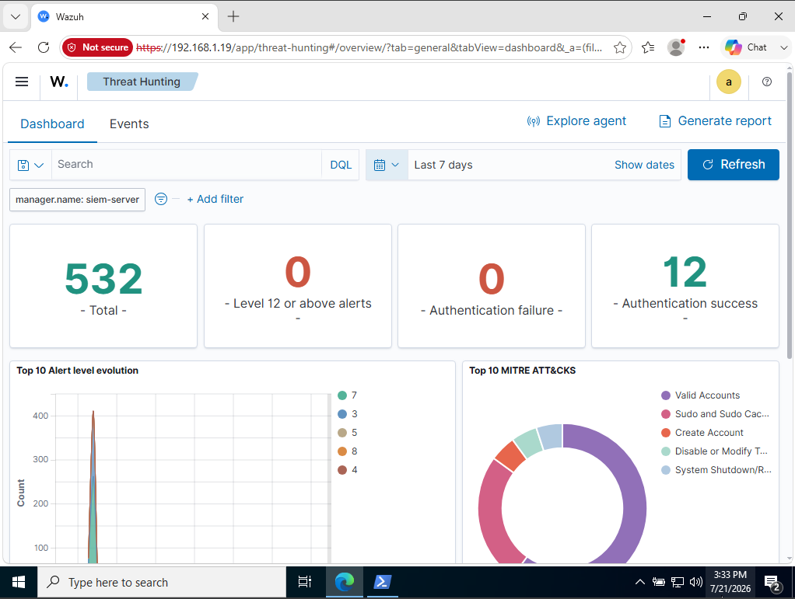
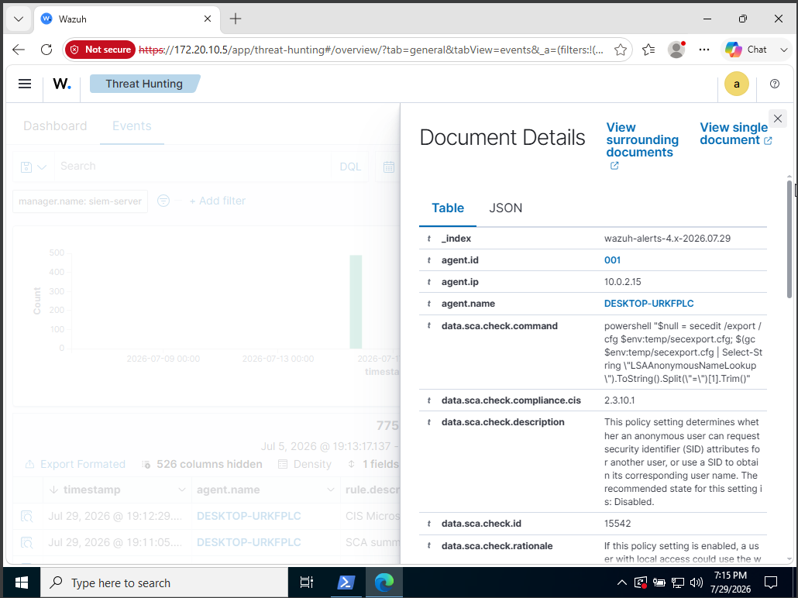

# 🛡️ Home SOC Lab: Deploying Wazuh SIEM & Endpoint Telemetry Monitoring

## 📌 Project Overview
This project demonstrates the end-to-end setup of a Security Operations Center (SOC) telemetry lab using **Wazuh SIEM**. The objective is to establish real-time endpoint monitoring, security configuration assessment (SCA), and log analysis between a Ubuntu-based SIEM Manager and a Windows 10 Target Endpoint.

---

## 🏗️ Architecture & Network Setup

* **SIEM Manager**: Wazuh 4.x Server running on **Ubuntu Server 22.04 LTS** (`172.20.10.5`)
* **Target Endpoint**: **Windows 10 Enterprise VM** running Wazuh Agent (`10.0.2.15`)
* **Deployment Model**: Multi-VM Lab Environment (Oracle VirtualBox) with host-only/bridged telemetry routing.

* ---

## 🚀 Key Implementation Steps

1. **Wazuh Manager Deployment**: 
   * Deployed single-node Wazuh indexer, server, and dashboard on Ubuntu Linux.
   * Configured systemd services and network permissions (`55000/tcp`, `1514/tcp`).

2. **Windows Agent Installation & Enrollment**:
   * Installed Wazuh Agent on Windows VM via PowerShell.
   * Updated `ossec.conf` to direct agent telemetry to the manager IP.
   * Verified active agent registration in the Wazuh Manager database.

3. **Log Collection & Analysis**:
   * Configured Windows Event Log collection (Security, System, PowerShell).
   * Conducted real-time log ingestion and threat hunting queries.

---

## 📸 Screenshots & Verification

### 01. Wazuh SIEM Dashboard & Agent Overview
Real-time dashboard showing active agent status, threat severity breakdown, and high-level alert trends.

---

### 02. Detailed Event Log & Policy Analysis
Deep dive into ingested telemetry showing expanded document details, agent identification, and System Configuration Assessment (SCA) security policy checks.

---

## 🔑 Skills Demonstrated
* **SIEM Deployment**: Wazuh Indexer & Dashboard Configuration.
* **Endpoint Security**: Agent Deployment, Config Tuning (`ossec.conf`), Systemd & Windows Services.
* **Threat Hunting & Incident Analysis**: Event Log parsing, JSON field extraction, and telemetry correlation.
* **Troubleshooting**: Host-to-VM networking, IP address management, and service health checks.
