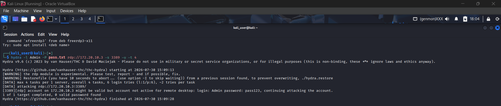
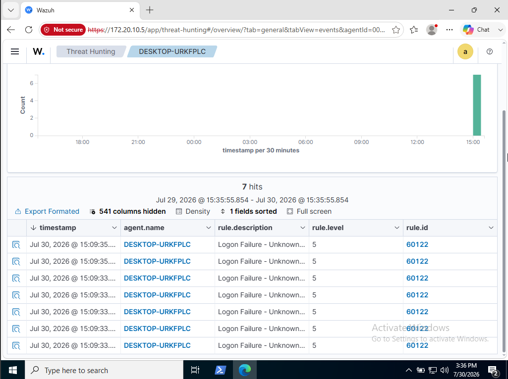
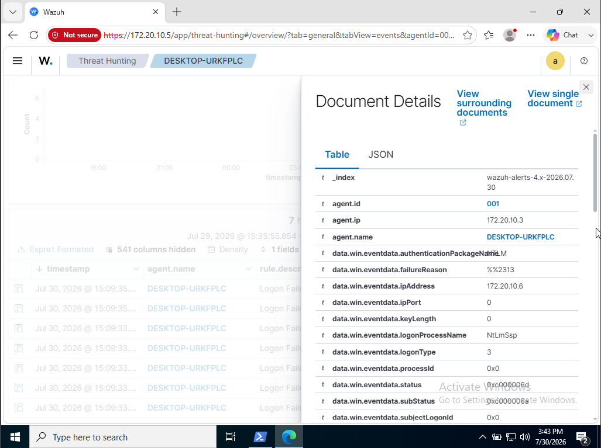

# Windows Threat Telemetry & RDP Incident Analysis Lab

**Adversary Emulation → SIEM Ingestion → Forensic Log Analysis**

[](#)
[](#)
[](#)
[](#)

---

## 1. Executive Summary

This repository documents a fully self-hosted, isolated home-lab exercise simulating an adversary **password-guessing attack against RDP (T1110.001)**, followed by end-to-end detection engineering using **Wazuh SIEM**. The lab covers the complete detection lifecycle: attack emulation → Windows Security Event Log generation (Event ID 4625) → agent-based log forwarding → SIEM correlation/alerting → analyst-level forensic triage of the raw JSON payload.

The objective was to validate that a standard, out-of-the-box Wazuh ruleset correctly fingerprints NTLM authentication failures over RDP and to extract the complete set of forensic indicators an analyst would use to build an incident timeline.

---

## 2. Lab Architecture

All systems were provisioned as isolated VMs on a private NAT/host-only network segment to ensure no traffic left the lab boundary.

| Role | System | OS / Software | IP Address | Identifier |
|---|---|---|---|---|
| **SIEM Manager** | Wazuh Server | Ubuntu 22.04 LTS | `172.20.10.5` | — |
| **Target Endpoint** | Windows Workstation | Windows 10 Pro (Wazuh Agent) | `172.20.10.3` | Agent ID `001` — `DESKTOP-URKFPLC` |
| **Adversary Host** | Attack Box | Kali Linux 2024.x | `172.20.10.6` | THC-Hydra |

**Data flow:** Kali (attacker) → RDP/3389 → Windows endpoint generates Event ID 4625 → Wazuh Agent forwards event → Wazuh Manager decodes/rules engine → Rule `60122` fires → Alert indexed and visualized on the Wazuh Dashboard.

```
[Kali Linux 172.20.10.6]
        │  hydra RDP brute-force (port 3389)
        ▼
[Windows 10 Endpoint 172.20.10.3] ── generates Security Event ID 4625
        │  Wazuh Agent (001 / DESKTOP-URKFPLC)
        ▼
[Wazuh Manager 172.20.10.5] ── Rule 60122 triggers (Level 5)
        │
        ▼
[Wazuh Dashboard] ── Alert visualization + JSON forensic artifact
```

---

## 3. Phase 1 — Attack Emulation (RDP Brute-Force)

**Objective:** Emulate a real-world credential-guessing attack against the RDP service to generate authentic Windows authentication failure telemetry.

| Attribute | Detail |
|---|---|
| Attack Vector | RDP Password Guessing |
| Attacker Tool | THC-Hydra v9.6 |
| Target Service | `rdp://172.20.10.3:3389` |
| Targeted Account | `Admin` |
| Threading | `-t 4` (4 parallel tasks) |

**Command executed on Kali Linux:**

```bash
hydra -l Admin -P pass.txt rdp://172.20.10.3 -s 3389 -u -t 4
```

**Command breakdown:**

| Flag | Meaning |
|---|---|
| `-l Admin` | Single login username to target |
| `-P pass.txt` | Password wordlist file used for guessing |
| `rdp://172.20.10.3` | Target service and IP |
| `-s 3389` | Explicit RDP service port |
| `-u` | Loop users first (optimizes attempt ordering) |
| `-t 4` | 4 concurrent login attempt threads |

> **Figure 1 — RDP Brute-Force Execution (Kali Terminal)**
> 
> Shows Hydra initiating the attack against `172.20.10.3:3389`, confirming 4 tasks per server and 6 login attempts (1 login × 6 passwords) scheduled against the `Admin` account.

---

## 4. Phase 2 — SIEM Telemetry & Forensic Analysis

### 4.1 Detection Summary

| Attribute | Value |
|---|---|
| Windows Event Source | Security Event ID 4625 (An account failed to log on) |
| Wazuh Rule ID | `60122` |
| Rule Description | Logon Failure – Unknown user or bad password |
| Severity | Level 5 (Default Wazuh Severity) |
| MITRE ATT&CK Technique | **T1110.001** — Brute Force: Password Guessing |
| Detection Volume | 7 correlated hits within the observed window |

> **Figure 2 — Alert Spike on Wazuh Dashboard**
> 
> The Events view (agent `DESKTOP-URKFPLC`) shows a sharp spike of 7 hits clustered at `15:09:33–15:09:35`, each tagged `rule.id: 60122`, `rule.level: 5`, `rule.description: Logon Failure - Unknown...` — directly correlating in time with the Hydra execution window shown in Figure 1.

### 4.2 Forensic IOC Breakdown (Raw JSON Document Details)

Drilling into an individual alert's **Document Details → Table** view exposes the full NTLM authentication failure payload forwarded by the Windows Agent.

| Field | Value | Analyst Interpretation |
|---|---|---|
| `_index` | `wazuh-alerts-4.x-2026.07.30` | Daily alert index (Wazuh 4.x indexing convention) |
| `agent.id` | `001` | Unique Wazuh agent identifier |
| `agent.ip` | `172.20.10.3` | Confirms source of the raw Windows event (the target endpoint, not the attacker) |
| `agent.name` | `DESKTOP-URKFPLC` | Victim/target hostname |
| `data.win.eventdata.authenticationPackageName` | `NTLM` | Confirms NTLM auth handshake used over RDP, not Kerberos |
| `data.win.eventdata.failureReason` | `%%2313` | Windows status message code — maps to *Unknown user name or bad password* |
| `data.win.eventdata.ipAddress` | **`172.20.10.6`** | **Attacker source IP** — direct pivot back to the Kali attack host |
| `data.win.eventdata.logonProcessName` | `NtLmSsp` | Logon process handling the NTLM negotiation |
| `data.win.eventdata.logonType` | `3` | Network Logon (consistent with remote RDP/network-based auth, not interactive) |
| `data.win.eventdata.status` | `0xc000006d` | `STATUS_LOGON_FAILURE` — general authentication failure |
| `data.win.eventdata.subStatus` | `0xc000006a` | `STATUS_WRONG_PASSWORD` — confirms a password-guessing failure specifically (not account lockout/disabled) |
| `data.win.eventdata.subjectLogonId` | `0x0` | No prior authenticated session context — anonymous/unauthenticated attempt |
| Targeted Account | `Admin` | Matches the `-l Admin` value passed to Hydra |

> **Figure 3 — Expanded JSON Document Details**
> 
> Full field-level breakdown of the NTLM authentication failure, isolating the attacker's source IP (`172.20.10.6`), the `NtLmSsp` logon process, and the dual status/sub-status codes (`0xc000006d` / `0xc000006a`) that together confirm a wrong-password rejection rather than an account-state issue.

### 4.3 Incident Timeline

| Timestamp (UTC-relative) | Event |
|---|---|
| `2026-07-30 15:09:13` | Hydra attack initiated from `172.20.10.6` against `172.20.10.3:3389` |
| `2026-07-30 15:09:33 – 15:09:35` | 7× Event ID 4625 (Logon Failure) generated on `DESKTOP-URKFPLC`, forwarded by Agent `001` |
| `2026-07-30 15:09:35` | Wazuh Rule `60122` correlates and indexes alerts (Level 5) |
| `2026-07-30 15:09:28` | Hydra completes — `0 valid passwords found` (attack unsuccessful against the tested wordlist) |

### 4.4 MITRE ATT&CK Mapping

| Tactic | Technique | ID | Evidence |
|---|---|---|---|
| Credential Access | Brute Force: Password Guessing | **T1110.001** | Repeated `NtLmSsp` logon failures (`0xc000006a`) from a single external IP against a single fixed account within a narrow time window |

---

## 5. Analyst Findings

- The attack was **successfully detected** by Wazuh's default ruleset (`60122`) without any custom rule authoring — validating out-of-the-box RDP/NTLM logon-failure coverage.
- The `logonType: 3` (Network) and `authenticationPackageName: NTLM` fields together fingerprint this as a **remote, non-interactive credential-guessing attempt**, distinguishing it from local console misuse.
- The `status`/`subStatus` code pair (`0xc000006d` / `0xc000006a`) allowed precise classification as a **wrong-password rejection**, ruling out account lockout, expired credentials, or disabled-account failure modes.
- Default alert severity (**Level 5**) is appropriate for an isolated failed-logon event but is **insufficient for real-world SOC triage**, since it does not reflect the *volume/frequency* pattern that defines brute-force behavior — this gap is the direct motivation for Module 2 below.
- The attacker's source IP (`172.20.10.6`) was fully recoverable from the endpoint-side telemetry alone, without any network-layer (firewall/IDS) evidence — demonstrating the value of host-based Windows Event Log forwarding.

---

## 6. Future Lab Roadmap

The following modules are planned to extend this lab from single-alert detection into a full detection-and-response pipeline. *(Not yet implemented — listed for roadmap transparency only.)*

| Module | Objective |
|---|---|
| **Module 2** | Custom XML Detection Engineering — parent-child correlated rules to escalate repeated `60122` hits within a time window to a Level 12 critical alert |
| **Module 3** | Endpoint Malware Telemetry — EICAR test-string detection and Windows Defender telemetry ingestion into Wazuh |
| **Module 4** | Active Response Automation — automated firewall blocking of malicious source IPs upon critical alert escalation |

---

## 7. Repository Structure

```
.
├── README.md
└── screenshots/
    ├── 03-hydra-attack.png
    ├── 04-brute-force-detection.png
    └── 05-brute-force-detection-2.png
```

---

## 8. Disclaimer

This lab was conducted entirely within an **isolated, self-owned virtual environment** (private NAT network, non-routable IP ranges) using systems and accounts under the author's sole control. No external, third-party, or production systems were targeted. This work is intended strictly for educational and portfolio demonstration purposes in the context of defensive security (Blue Team / SOC) skill development.
